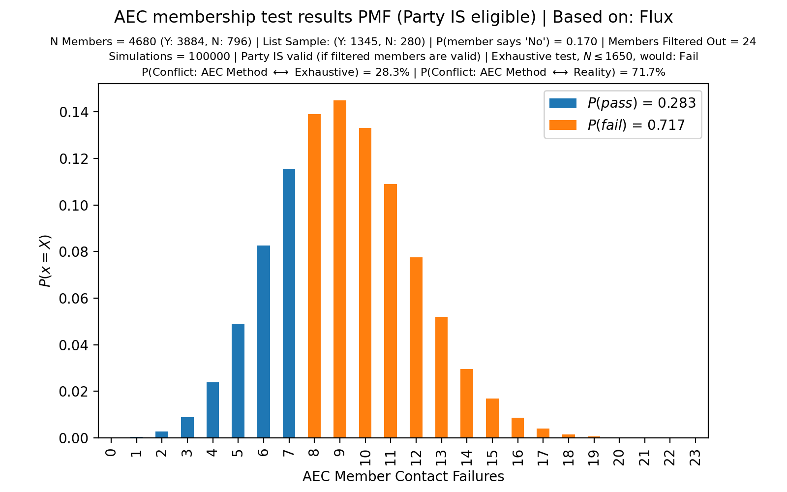
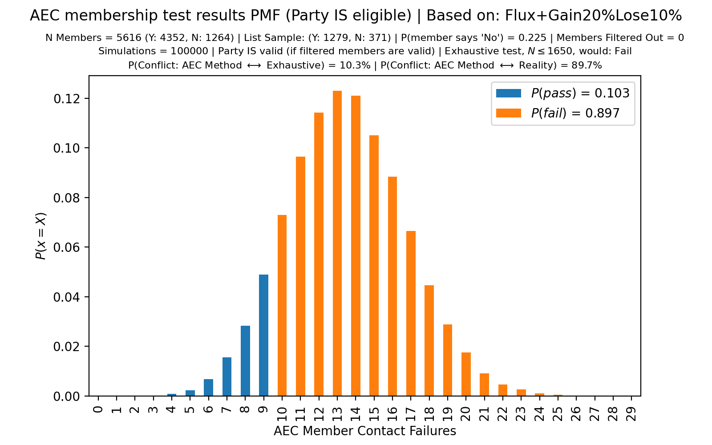
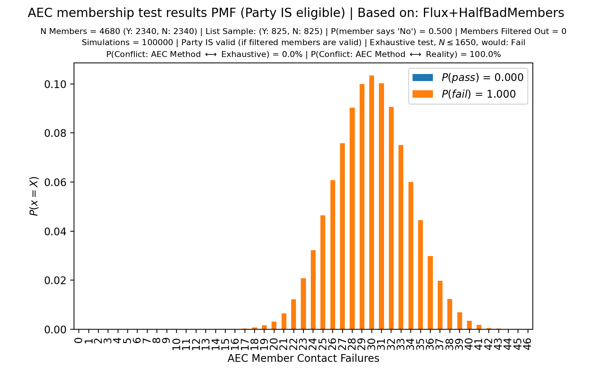

# AEC Party Membership Test Methodology is Rigged! A Statistical Analysis of AEC Methodology and Graphs (of PMFs)

In Australia, to register a political party you need a minimum number of members.
Federally, that's 1500.

Recently (September 2021), parliamentarians (i.e., the 4 major parties) decided there was just too much competition! That would not do. So, a bunch of changes were made to the Electoral Act to make life harder for anyone who wanted to be part of our democracy, but did not want to participate in the rotten, tribalist, political cults that run the show. Some of those changes resulted in the pending deregistration of 12 parties, and the very real deregistration of 9 parties. In practice that is ~40% of parties, gone before the next election.

Every few years, the Australian Electoral Commission (AEC) will check that each political party has enough members according to the legislative requirement. The party must provide a list of 1500 to 1650 names (inclusive) to use as evidence of their eligibility. The AEC will then filter out some names (duplicates, dead people, etc). That produces a NEW list of <= 1650 names. Then, the AEC will do a statistical sampling of members and will use that to determine whether a party is eligible. Particularly, those names selected are asked to confirm or deny their membership. In this project: "failure rate" refers to the rate at which members respond "No".

The AEC does not accept lists larger than 1650; there is no chance for a party to replace any of those filtered members; that filtering process increases the chance of false negatives; and standard of statistical evaluation is to assume that the list of 1650 members were *the only members* of the party. Zero consideration is given beyond this. How many parties have been wrongly denied registration? Nobody knows.

[The method is detailed on pages 23 and 24 of "Guide for registering a
party".](https://www.aec.gov.au/Parties_and_Representatives/Party_Registration/guide/files/party-registration-guide.pdf)
([mirror](party-registration-guide.pdf))

Flux failed it's recent membership test. The only problem? We have at least 4680 members whose details have been matched against the electoral roll. It is the AEC's imposition of 1650 members maximum that is the problem.

* [AEC's Notice to Flux (with results)](docs/BDLPN0-aec-flux-jan-13_unencrypted.pdf)
* [Our Response](docs/Response-to-AEC-rego-20220213.pdf)

Here is an except from the first page, to give you an idea of the gist:

> We have 3 arguments supporting our case. Each argument is *individually* sufficient to show
that a decision (by the AEC) to deregister the Party would not be based on reasonable
grounds; each argument is a *decisive criticism* of the current methodology.
>
> * The statistical method used fails ~10% of the time for borderline cases.
> * The statistical method uses an artificially limited sample size and thus does not estimate party membership, though does (roughly) measure membership attrition.
> * We have sufficient membership and provide evidence. **Attached is a list of 4680 members. Each entry was, at some point, verified against the electoral roll.**
>
> Unless each of these criticisms can be addressed, we do not believe that a decision by the AEC to deregister the Party would be based in reality.

(Note: there are at least two non-critical errors in our response -- the AEC has already been informed. See the end of the doc for what was sent to the AEC re those errors.)

Yesterday (2022-02-14) I was curious about the *actual* statistical properties of the AEC's process. How likely would it have been for us to succeed? (Given that we are **in fact** an eligible party.)

Turns out there was a 71.7% chance that the AEC's method would find a false negative.

## TL;DR: It's fuckin' rigged.

----

## Running this simulator

Tested w/ python 3.9 and 3.10. (3.8 did not work.)

Install python3 deps: `pip3 install matplotlib pandas click`

For arguments, run `./main.py --help`

To add a set of parameters, add a new line in `main.py` under the `aec()` function.
Parameters are: number of trials in the simulation, the population size of members from which the party can choose a membership list to provide, the failure rate of members confirming their membership when contacted, and the number of members that are filtered out of the list (reasons include: they support the registration of another party, they're deceased, or the details cannot be matched against the electoral roll).

## Major Findings

In the case of Flux's recent membership audit, the simulation shows that -- *on the assumption that Flux is an eligible party*, and that 17% of members provided will respond "No" -- there is a 71.7% chance of the AEC reaching a *false negative* result. In such a case, Flux would still have over 3,800 members that respond "Yes" (or do not respond).

Moreover, say that Flux is gaining members faster than it is loosing them. ('Loosing' members means that they will now answer "No" but do not revoke their membership.) It turns out that this makes the AEC's methodology *less likely to succeed.*

## **The system is rigged. It's a farce.**

Finally, there are even more cases where the AEC's method fails spectacularly.

Say 50% of Flux's 4680 members submitted (as part of our objection to the AEC's consideration of involuntary deregistration) respond "No" -- the AEC's method fails 100% of the time in this case, even though Flux would exceed the legislative requirement by 1.56x.

---

    
     
    <em>Even though an assumption of this simulation is that Flux is an eligible political party, the AEC's method fails 71.7% of the time.</em>

---

    
     
    <em>This distribution shows that the AEC's validation method becomes less reliable as a party *gains* members. <strong>Improvement makes life harder! Strength is weakness!</strong></em>

---

    
     
    <em>If we assume that Flux provides 4680 members but only 50% of them will respond "Yes" or not respond -- indicating 2340 valid members and indicating that Flux is an eligible party -- the AEC's method fails 100% of the time.</em>

---

## Some State ECs are Worse

The Electoral Commissions of both NSW and Victoria have verification methods that are **deliberately** designed to **prevent** valid parties from registering -- or, at the very least, the methods are dishonestly defended.

Here is an example from Flux's attempt to register in Victoria.
This is what happens if you volunteer to play by their rules.

There's no author attributed to this excerpt from [Electoral Regulation Research Network newsletter - April 2019](https://law.unimelb.edu.au/__data/assets/pdf_file/0015/3052014/ERRN-newsletter-April-2019-final.pdf) (perhaps they knew they were being dishonest, though I doubt it).

> VCAT decided on an application to review a decision of the Victorian Electoral Commission (VEC) to refuse to register The Flux Party – Victoria as a political party.
>
> [...]
>
> In her Order, made on 23 October 2018, Justice Hampel, Vice President of VCAT, refuted every one of Mr Millington’s arguments.

[Source material (VCAT Judgement)](https://www.austlii.edu.au/cgi-bin/viewdoc/au/cases/vic/VCAT/2018/1661.html?context=1;query=Millington%20v%20Victorian%20Electoral%20Commission;mask_path=)

Here's a sample of such a "refutation":

> [...] This submission is equally flawed. An argument based on probabilities is unsound.
>
> ---
>
> 
<a href="https://www.austlii.edu.au/cgi-bin/viewdoc/au/cases/vic/VCAT/2018/1661.html?context=1;query=Millington%20v%20Victorian%20Electoral%20Commission;mask_path=">Her Honour Judge Hampel, Vice President VCAT</a>

I wonder what she thinks **beyond reasonable doubt** means, and what she thought the VEC's argument (in support of its determination) was based on.

It is clear that Hampel has literally no understanding of statistics or probabilities.

Perhaps, if she had a high-school level understanding of probability theory, then she would know about the binomial theorem and maybe gain a small intuition for how wrong she is.

As a witness in this case, my evidence was dismissed because I did not work as a statistician.
No effort was made to enquire into the method.
That's the sort of piss-poor thinking that leads to problems the AEC's method being used.

Say you wanted to verify my account of the case?
How would you verify the record of the tribunal?
You can't -- it's not public. Tough.

To be clear: I do not think the VEC or VCAT broke the law at any point.
I do think they are heavily biased towards the status quo, though.
I do not think they are honest with themselves regarding these biases.

I'm sure Hampel is a very nice person and does lots of nice things.
It does not change the fact that she is unable to tell the boundaries of her own incompetence.

## Appendix: Errors in Feb 13 response to AEC

<blockquote>

First, in the section "The AEC’s membership test methodology artificially reduces sample size":

<blockquote>
Keep in mind that – given this experimental setup – we’d expect 9 or more failures 10% of
the time. If we were doing this experiment in real life, 10% of the time we would
underestimate the number of cars by a factor of more than 2500x.
</blockquote>

This is a typo -- we'd expect 8 or more failures 10% of the time, and 9 or more failures ~5% of the time.

Second, in the section "Closing remarks":

<blockquote>
Consider a soon-to-be-registered party with 1650 valid members (assume this is true). What
happens if 200 malicious members join (prior to registration), with the sole purpose of
preventing that party from registering? Then, it’s expected that ~10.8% of the membership
list provided to the AEC as part of their registration application are these malicious members.
Thus the failure rate according to the AEC’s methodology is expected to exceed the current
threshold (set by the AEC) – the AEC would conclude that the party does not meet
requirements.
</blockquote>

The italicized part is not correct. The AEC's method is much better than this -- it only fails 10% to 20% of the time (the above quote implies that the method fails more than 50% of the time). The exact false negative rate depends on the number of members filtered by the AEC, similar to how our December 2021 list of 1649 names had 24 entries filtered. The AEC's method is more reliable when fewer names are filtered, with the 20% false negative rate corresponding to 25 members filtered out. (0 names filtered corresponds to a 10% false negative rate.)

It is worth pointing out that there are similar (though slightly more extreme) parameters that do result in a >50% failure rate of the AEC's method. For example a party of 2000 members, 300 of which are malicious, and 15 names filtered has a failure rate of 50.4%.

</blockquote>
